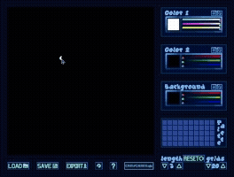
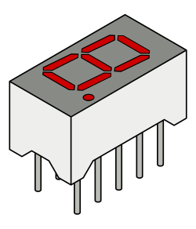
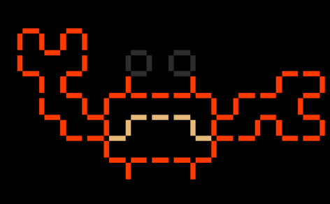
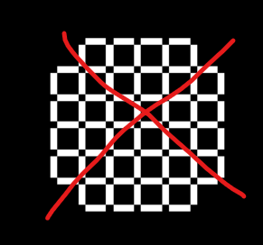
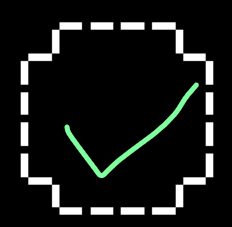
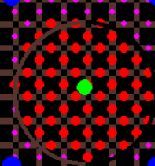
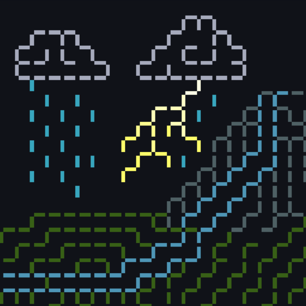
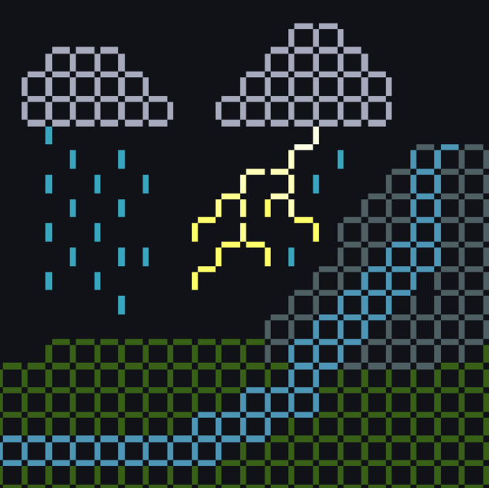

# Pixel Void

*A drawing app where you draw on the border between pixels -"In void of pixels"*

## Table of contents:
1. [Installation](#installation)
2. [How to Use](#how-to-use)
3. [About](#about)
4. [Tips and Tricks](#tips-and-tricks)
5. [Credits](#credits)

 ## Installation 
 

click to expand/collapse

### Windows
Click [here]() to download

run the `PixelVoid.exe` file

If a blue screen shows up warning you about running it, click "More Info", then "Run Anyways"
### MacOS 
Click [here]() to download

run the `PixelVoid.exe` file

THIS HAS YET TO BE IMPLEMENTED
### Linux
Click [here]() to download

THIS HAS YET TO BE IMPLEMENTED

## How to Use

click to expand/collapse

### Required items:  
Mouse and keyboard

### Controls:
**left click** - draw with color 1  
**right click** - draw with color 2  
**mouse wheel** - change brush size  
**ctrl+z** - undo  
**ctrl+shift+z** - redo  
**ctrl+d** - toggle debug mode (for funsies)  
**esc** - prompts you to quit app  
### Drawing:
Click and drag on the canvas (big square on the top left of the screen) to draw.  

if you left click and right click at the same time, the brush color is averaged out between the two.  

Click the + to add a color to the palette. Clicking on the color inside the palette lets you change color1, color2, or the background to that color.

It is recommended to set color2 to the background color to use it as an eraser.
### Loading/Saving:

You can save your art using the "Save" Button. This saves it as an npz (numpy) file.  
Saving a file saves the canvas, your color palette, and the current colors.

Clicking "Load" lets you import an npz file. Do not load any files you did not acquire from this app, as it may result in an error. 

The "Export" button lets you save the image as a png or jpg, which is going to be 500x500 pixels.
### Resetting:
  
This section of the interface lets you reset the canvas.

**length** - This determines how big each line is, in pixels. Note that pixels are scaled up before rendering.  
**grids** - This determines how many squares it makes

Once you select these to your liking, click **reset**.  
All lines/segments will be set to color2 by default. You can use this as a way to quickly fill your canvas with a color as well.

## About

click to expand/collapse

On May 2026, I was trying to wire a 7 segment display to an arduino, and realized something about them - a 7 segment display is basically just a grid of 2 squares. What if this could be expanded?

This began the concept of my project

To me, limitations can make things more fun or interesting, and behold! The places you can draw are limited. The more I drew on this, the more I enjoyed the process of drawing on it!

## Tips and Tricks

click to expand/collapse

These are not required, but might help!

---

Avoid filling the entire canvas in a grid. Do not treat this like pixel art, instead try drawing with lines.  

---

The brush only draws if the center point of each line is touched by the brush. You can visualize these points using debug mode.

---

Use the lines to your advantage! They aren't just pixels, they have direction! Notice how on the image to the left, the lines are not filled in all the way. This gives the subject more character, and you can express more detail in the limited space.

---

## Credits

click to expand/collapse

Font used - ["Grape Soda"](https://www.dafont.com/grapesoda-2.font) by [jeti](https://www.dafont.com/jeti.d1589) under [CC BY 4.0](https://creativecommons.org/licenses/by/4.0/)  
All other art assets and code by [carinshark](https://github.com/carinshark)  

Images in README.md are screenshots from the app, or from the public domain.

Code written in python 3.14.3  
Art made in [Aseprite](https://www.aseprite.org/)

Made for Hackclub Stardance

